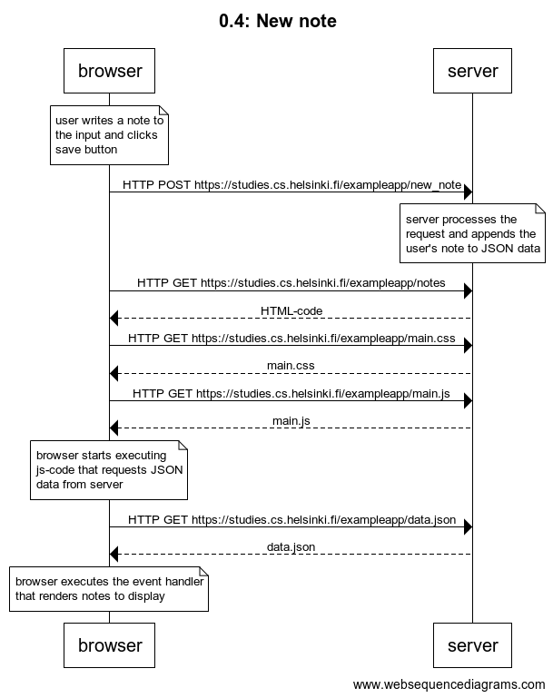

# 0.4: new note

## Exercise

Create a similar diagram depicting the situation where the user creates a new note on page https://studies.cs.helsinki.fi/exampleapp/notes when writing something into the text field and clicking the submit button.

## Answer
Diagram:



Code:

```
note over browser:
the user writes a note
in the input and clicks submit
end note
browser->server: HTTP POST https://studies.cs.helsinki.fi/exampleapp/new_note
note over server:
server processes the request,
appends the note to JSON data
end note
browser->server: HTTP GET https://studies.cs.helsinki.fi/exampleapp/notes
server-->browser: HTML-code
browser->server: HTTP GET https://studies.cs.helsinki.fi/exampleapp/main.css
server-->browser: main.css
browser->server: HTTP GET https://studies.cs.helsinki.fi/exampleapp/main.js
server-->browser: main.js

note over browser:
browser starts executing js-code
that requests JSON data from server
end note

browser->server: HTTP GET https://studies.cs.helsinki.fi/exampleapp/data.json
server-->browser: data.json

note over browser:
browser executes the event handler
that renders notes to display
end note

```
